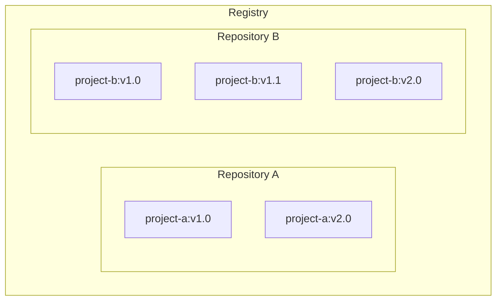

# Docker Images

Source: Docker Documentation
URL: https://docs.docker.com/get-started/docker-concepts/the-basics/what-is-an-image/
License: Apache-2.0 (license of the original documentation; this file is an excerpt reformatted as Markdown)

## What Is a Container Image?

Seeing as a container is an isolated process, where does it get its files and configuration? How do you share those environments?

That's where container images come in. A container image is a standardized package that includes all of the files, binaries, libraries, and configurations to run a container.

For a PostgreSQL image, that image will package the database binaries, config files, and other dependencies. For a Python web app, it'll include the Python runtime, your app code, and all of its dependencies.

There are two important principles of images:

1. Images are immutable. Once an image is created, it can't be modified. You can only make a new image or add changes on top of it.

2. Container images are composed of layers. Each layer represents a set of file system changes that add, remove, or modify files.

These two principles let you to extend or add to existing images. For example, if you are building a Python app, you can start from the Python image and add additional layers to install your app's dependencies and add your code. This lets you focus on your app, rather than Python itself.

### Finding images

Docker Hub is the default global marketplace for storing and distributing images. It has over 100,000 images created by developers that you can run locally. You can search for Docker Hub images and run them directly from Docker Desktop.

Docker Hub provides a variety of Docker-supported and endorsed images known as Docker Trusted Content. These provide fully managed services or great starters for your own images. These include:

- Docker Official Images - a curated set of Docker repositories, serve as the starting point for the majority of users, and are some of the most secure on Docker Hub
- Docker Hardened Images - minimal, secure, production-ready images with near-zero CVEs, designed to reduce attack surface and simplify compliance. Free and open source under Apache 2.0
- Docker Verified Publishers - high-quality images from commercial publishers verified by Docker
- Docker-Sponsored Open Source - images published and maintained by open-source projects sponsored by Docker through Docker's open source program

For example, Redis and Memcached are a few popular ready-to-go Docker Official Images. You can download these images and have these services up and running in a matter of seconds. There are also base images, like the Node.js Docker image, that you can use as a starting point and add your own files and configurations. For production workloads requiring enhanced security, Docker Hardened Images offer minimal variants of popular images like Node.js, Python, and Go.

## Understanding Image Layers

As you learned in [What is an image?](../the-basics/what-is-an-image/), container images are composed of layers. And each of these layers, once created, are immutable. But, what does that actually mean? And how are those layers used to create the filesystem a container can use?

### Image layers

Each layer in an image contains a set of filesystem changes - additions, deletions, or modifications. Let’s look at a theoretical image:

1. The first layer adds basic commands and a package manager, such as apt.
2. The second layer installs a Python runtime and pip for dependency management.
3. The third layer copies in an application’s specific requirements.txt file.
4. The fourth layer installs that application’s specific dependencies.
5. The fifth layer copies in the actual source code of the application.

This example might look like:

This is beneficial because it allows layers to be reused between images. For example, imagine you wanted to create another Python application. Due to layering, you can leverage the same Python base. This will make builds faster and reduce the amount of storage and bandwidth required to distribute the images. The image layering might look similar to the following:

Layers let you extend images of others by reusing their base layers, allowing you to add only the data that your application needs.

### Stacking the layers

Layering is made possible by content-addressable storage and union filesystems. While this will get technical, here’s how it works:

1. After each layer is downloaded, it is extracted into its own directory on the host filesystem.
2. When you run a container from an image, a union filesystem is created where layers are stacked on top of each other, creating a new and unified view.
3. When the container starts, its root directory is set to the location of this unified directory, using `chroot`.

When the union filesystem is created, in addition to the image layers, a directory is created specifically for the running container. This allows the container to make filesystem changes while allowing the original image layers to remain untouched. This enables you to run multiple containers from the same underlying image.

## Registries and Repositories

Now that you know what a container image is and how it works, you might wonder - where do you store these images?

Well, you can store your container images on your computer system, but what if you want to share them with your friends or use them on another machine? That's where the image registry comes in.

An image registry is a centralized location for storing and sharing your container images. It can be either public or private. Docker Hub is a public registry that anyone can use and is the default registry.

While Docker Hub is a popular option, there are many other available container registries available today, including Amazon Elastic Container Registry (ECR), Azure Container Registry (ACR), and Google Container Registry (GCR). You can even run your private registry on your local system or inside your organization. For example, Harbor, JFrog Artifactory, GitLab Container registry etc.

### Registry vs. repository

While you're working with registries, you might hear the terms _registry_ and _repository_ as if they're interchangeable. Even though they're related, they're not quite the same thing.

A _registry_ is a centralized location that stores and manages container images, whereas a _repository_ is a collection of related container images within a registry. Think of it as a folder where you organize your images based on projects. Each repository contains one or more container images.

The following diagram shows the relationship between a registry, repositories, and images.

> **Tip**
>
> A Docker Personal plan gives you one private repository and unlimited public repositories. To get unlimited private repositories, upgrade to the Docker Team plan.
