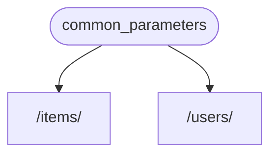

# FastAPI Dependency Injection

Source: FastAPI Documentation
URL: https://fastapi.tiangolo.com/tutorial/dependencies/
Version: 0.141.1
License: MIT (license of the original documentation; this file is an excerpt reformatted as Markdown)

## Overview

**FastAPI** has a very powerful but intuitive **Dependency Injection** system.

It is designed to be very simple to use, and to make it very easy for any developer to integrate other components with **FastAPI**.

## What is "Dependency Injection"

**"Dependency Injection"** means, in programming, that there is a way for your code (in this case, your *path operation functions*) to declare things that it requires to work and use: "dependencies".

And then, that system (in this case **FastAPI**) will take care of doing whatever is needed to provide your code with those needed dependencies ("inject" the dependencies).

This is very useful when you need to:

* Have shared logic (the same code logic again and again).
* Share database connections.
* Enforce security, authentication, role requirements, etc.
* And many other things...

All these, while minimizing code repetition.

## First Steps

Let's see a very simple example. It will be so simple that it is not very useful, for now.

But this way we can focus on how the **Dependency Injection** system works.

### Create a dependency, or "dependable"

Let's first focus on the dependency.

It is just a function that can take all the same parameters that a *path operation function* can take:

```python
from typing import Annotated

from fastapi import Depends, FastAPI

app = FastAPI()

async def common_parameters(q: str | None = None, skip: int = 0, limit: int = 100):
    return {"q": q, "skip": skip, "limit": limit}

@app.get("/items/")
async def read_items(commons: Annotated[dict, Depends(common_parameters)]):
    return commons

@app.get("/users/")
async def read_users(commons: Annotated[dict, Depends(common_parameters)]):
    return commons
```

That's it.

**2 lines**.

And it has the same shape and structure that all your *path operation functions* have.

You can think of it as a *path operation function* without the "decorator" (without the `@app.get("/some-path")`).

And it can return anything you want.

In this case, this dependency expects:

* An optional query parameter `q` that is a `str`.
* An optional query parameter `skip` that is an `int`, and by default is `0`.
* An optional query parameter `limit` that is an `int`, and by default is `100`.

And then it just returns a `dict` containing those values.

> **Note**
>
> FastAPI added support for `Annotated` (and started recommending it) in version 0.95.0.
>
> If you have an older version, you would get errors when trying to use `Annotated`.
>
> Make sure you Upgrade the FastAPI version to at least 0.95.1 before using `Annotated`.
>

### Import Depends

```python
from typing import Annotated

from fastapi import Depends, FastAPI

app = FastAPI()

async def common_parameters(q: str | None = None, skip: int = 0, limit: int = 100):
    return {"q": q, "skip": skip, "limit": limit}

@app.get("/items/")
async def read_items(commons: Annotated[dict, Depends(common_parameters)]):
    return commons

@app.get("/users/")
async def read_users(commons: Annotated[dict, Depends(common_parameters)]):
    return commons
```

### Declare the dependency, in the "dependant"

The same way you use `Body`, `Query`, etc. with your *path operation function* parameters, use `Depends` with a new parameter:

```python
from typing import Annotated

from fastapi import Depends, FastAPI

app = FastAPI()

async def common_parameters(q: str | None = None, skip: int = 0, limit: int = 100):
    return {"q": q, "skip": skip, "limit": limit}

@app.get("/items/")
async def read_items(commons: Annotated[dict, Depends(common_parameters)]):
    return commons

@app.get("/users/")
async def read_users(commons: Annotated[dict, Depends(common_parameters)]):
    return commons
```

Although you use `Depends` in the parameters of your function the same way you use `Body`, `Query`, etc, `Depends` works a bit differently.

You only give `Depends` a single parameter.

This parameter must be something like a function.

You **don't call it** directly (don't add the parenthesis at the end), you just pass it as a parameter to `Depends()`.

And that function takes parameters in the same way that *path operation functions* do.

> **Tip**
>
> You'll see what other "things", apart from functions, can be used as dependencies in the next chapter.
>

Whenever a new request arrives, **FastAPI** will take care of:

* Calling your dependency ("dependable") function with the correct parameters.
* Get the result from your function.
* Assign that result to the parameter in your *path operation function*.



This way you write shared code once and **FastAPI** takes care of calling it for your *path operations*.

> **Tip**
>
> Notice that you don't have to create a special class and pass it somewhere to **FastAPI** to "register" it or anything similar.
>
> You just pass it to `Depends` and **FastAPI** knows how to do the rest.
>

## Share Annotated dependencies

In the examples above, you see that there's a tiny bit of **code duplication**.

When you need to use the `common_parameters()` dependency, you have to write the whole parameter with the type annotation and `Depends()`:

```Python
commons: Annotated[dict, Depends(common_parameters)]
```

But because we are using `Annotated`, we can store that `Annotated` value in a variable and use it in multiple places:

```python
from typing import Annotated

from fastapi import Depends, FastAPI

app = FastAPI()

async def common_parameters(q: str | None = None, skip: int = 0, limit: int = 100):
    return {"q": q, "skip": skip, "limit": limit}

CommonsDep = Annotated[dict, Depends(common_parameters)]

@app.get("/items/")
async def read_items(commons: CommonsDep):
    return commons

@app.get("/users/")
async def read_users(commons: CommonsDep):
    return commons
```

> **Tip**
>
> This is just standard Python, it's called a "type alias", it's actually not specific to **FastAPI**.
>
> But because **FastAPI** is based on the Python standards, including `Annotated`, you can use this trick in your code. 😎
>

The dependencies will keep working as expected, and the **best part** is that the **type information will be preserved**, which means that your editor will be able to keep providing you with **autocompletion**, **inline errors**, etc. The same for other tools like `mypy`.

This will be especially useful when you use it in a **large code base** where you use **the same dependencies** over and over again in **many *path operations***.

## To async or not to async

As dependencies will also be called by **FastAPI** (the same as your *path operation functions*), the same rules apply while defining your functions.

You can use `async def` or normal `def`.

And you can declare dependencies with `async def` inside of normal `def` *path operation functions*, or `def` dependencies inside of `async def` *path operation functions*, etc.

It doesn't matter. **FastAPI** will know what to do.

> **Note**
>
> If you don't know, check the Async: *"In a hurry?"* section about `async` and `await` in the docs.
>

## Simple usage

If you look at it, *path operation functions* are declared to be used whenever a *path* and *operation* matches, and then **FastAPI** takes care of calling the function with the correct parameters, extracting the data from the request.

Actually, all (or most) of the web frameworks work in this same way.

You never call those functions directly. They are called by your framework (in this case, **FastAPI**).

With the Dependency Injection system, you can also tell **FastAPI** that your *path operation function* also "depends" on something else that should be executed before your *path operation function*, and **FastAPI** will take care of executing it and "injecting" the results.

Other common terms for this same idea of "dependency injection" are:

* resources
* providers
* services
* injectables
* components

## Using the same dependency multiple times

If one of your dependencies is declared multiple times for the same *path operation*, for example, multiple dependencies have a common sub-dependency, **FastAPI** will know to call that sub-dependency only once per request.

And it will save the returned value in a "cache" and pass it to all the "dependants" that need it in that specific request, instead of calling the dependency multiple times for the same request.

In an advanced scenario where you know you need the dependency to be called at every step (possibly multiple times) in the same request instead of using the "cached" value, you can set the parameter `use_cache=False` when using `Depends`:

```Python hl_lines="1"
async def needy_dependency(fresh_value: Annotated[str, Depends(get_value, use_cache=False)]):
    return {"fresh_value": fresh_value}
```

> **Tip**
>
> Prefer to use the `Annotated` version if possible.
>

```Python hl_lines="1"
async def needy_dependency(fresh_value: str = Depends(get_value, use_cache=False)):
    return {"fresh_value": fresh_value}
```
